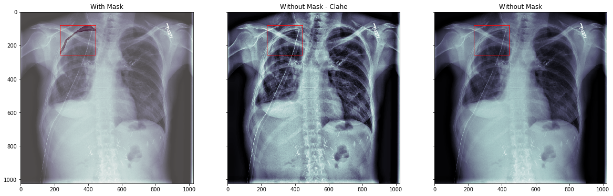
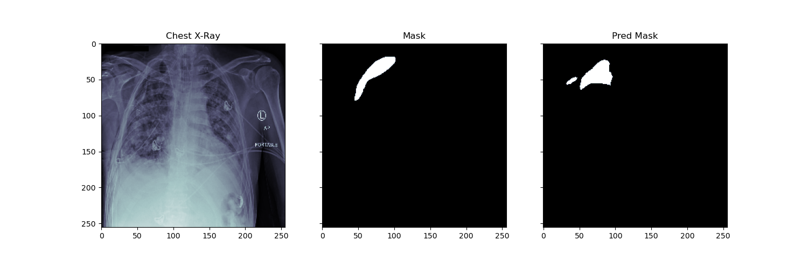
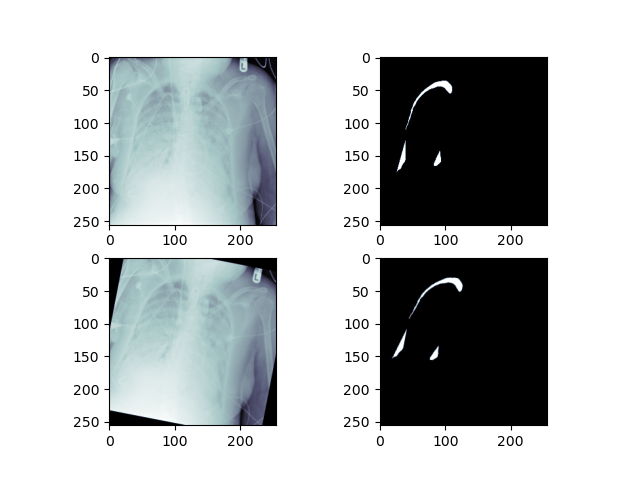
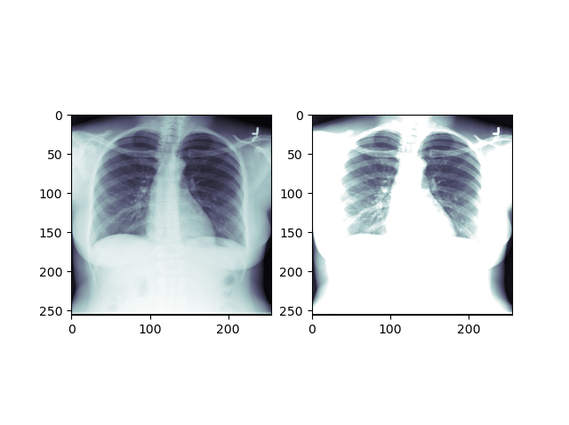
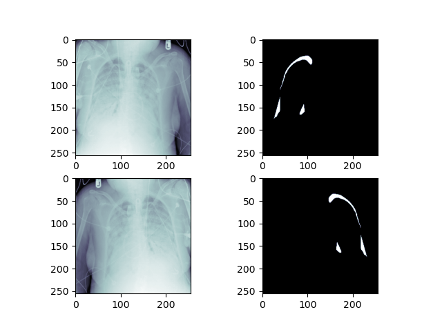
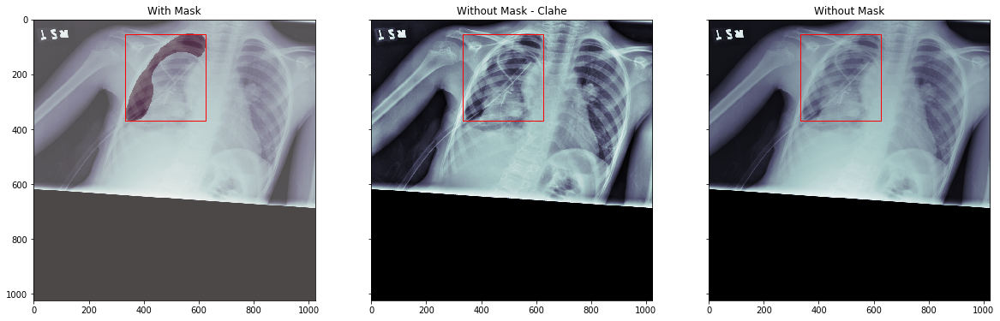

# SIIM-ACR Pneumothorax Segmentation

> Identify Pneumothorax disease in chest x-rays

Pneumothorax can be caused by a blunt chest injury, damage from underlying lung disease, or most horrifying—it may occur for no obvious reason at all. On some occasions, a collapsed lung can be a life-threatening event.

Pneumothorax is usually diagnosed by a radiologist on a chest x-ray, and can sometimes be very difficult to confirm. An accurate AI algorithm to detect pneumothorax would be 
useful in a lot of clinical scenarios. AI could be used to triage chest radiographs for priority interpretation, or to provide a more confident diagnosis for non-radiologists.

> Kaggle Page

All data and information regarding this project has been taken from the following Kaggle Competition
  https://www.kaggle.com/c/siim-acr-pneumothorax-segmentation/overview/description

> Ideas and Notes

- Augmentation heavily to help increase robustness, there is a pretty small amount of data in this dataset. More augmentation techniques could definitely be added to this repository. Ideas for additional augmentations: Horizonta/Vertical Shift, Vertical Flip, Zoom. Could be beneficial to play around with Augmentation rates as well as the augmentation values.

- Some of the training images seem poor in quality (See imgs/11.png), I have noticed multiple training images that look like this. One of the images was upside down (See prediction_examples/6.png). Augmentation should hopefully help with this, additional analysis of the rate of pneumo positive images that are distorted could be helpful. I have removed a small number of images that were flagged in training as Pneumo positive but do not have any annotation.

- The images seem to be at varying scales and rotations, it could be beneficial to isolate the lung area using a separate algorithm and remove the rest of the image.

- Images for Men and Women are substantially different, would be interesting to assess algorithm performance on metrics such as sex, age etc.

- Algorithm utilised was simply Res-U-Net, there are many other options for semantic segmentation and it would be worth exploring these given the hardware and time to do so.

- Evaluation Metrics - At this stage evaluation metrics after model development is the Dice Coefficient. It would be useful in a practical case utilise an AUC-ROC metric to determine false-positive/negative rates of the Algorithm. Would be good to have a stronger understanding of the prediction False-Positive rates as a function of area as well as detection.

- Evaluation Visualisation - Currently I am just using the Dice Coefficient to measure performance against a fraction of the training data that has been isolated from the data used to train the model. It would be good to run training multiple times and assess the performance against multiple slices of the training data.